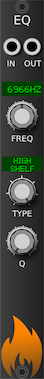
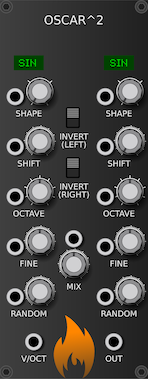

# Charred Desert

        

A collection of esoteric modules for VCV Rack.

* [CV-SEQ](CVSeq.md) - a four step sequencer for CV
* [DTMF](DTMF.md) - telephone tones
* [EQ](Eq.md) - simple equalizer module
* [Noise](Noise.md) - white and pink noise generator
* [Not](Not.md) - invert your signal, either as CV or a waveform
* [Oscar^2](Oscar2.md) - oscillator madness
* [Pan](Pan.md) - stereo pan a mono input
* [Shift](Shift.md) - CV and waveform shifter
* [Carbon](Carbon.md) - moog-like filter
