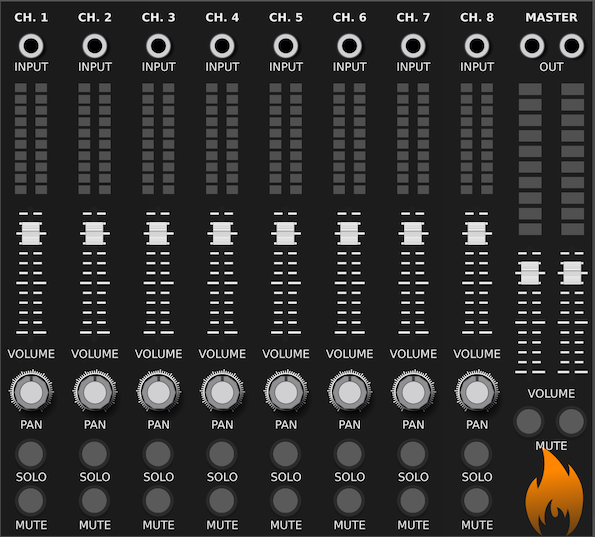

---
title: "Mixer Manual"
author: [SV Modular]
date: "October, 2019"
subject: "Charred Desert"
keywords: [CharredDesert, VCVRack, Manual]
lang: "en"
titlepage: true
logo: "images/SVModular.png"
...

# Mixer

**Mixer** is an 8 input mixing module.

Each channel consists of an `INPUT`, `LED` volume indicator, `VOLUME` adjustment,
`PAN` for stereo mixing, `SOLO` for specifying the soloing of a track, and
`MUTE` to mute a track.
