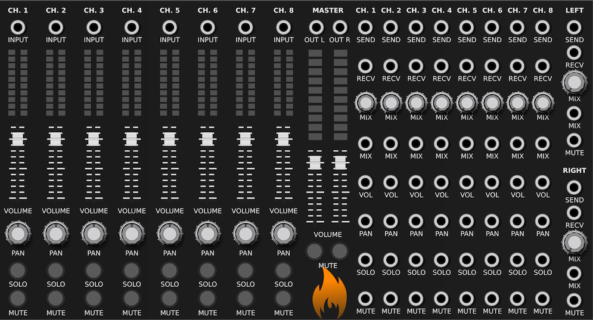

---
title: "MixerCV Manual"
author: [SV Modular]
date: "October, 2019"
subject: "Charred Desert"
keywords: [CharredDesert, VCVRack, Manual]
lang: "en"
titlepage: true
logo: "images/SVModular.png"
...

# MixerCV

**MixerCV** is an 8 input mixing module with the addition of CV inputs to
automate parameters, as well as Send/Receive functionality on a per-track
basis.

Each channel consists of an `INPUT`, `LED` volume indicator, `VOLUME` adjustment,
`PAN` for stereo mixing, `SOLO` for specifying the soloing of a track, and
`MUTE` to mute a track.

In addition, `SEND` allows for each track to send to an external effect module,
along with `RECV` to receive the output.  The `MIX` or "wetness" of this effect
can be set with the `MIX` knob, as well as with the `MIX` CV input.
