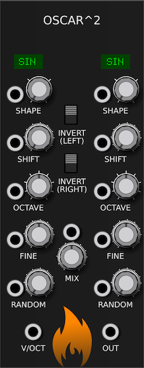

---
title: "Oscar^2 Manual"
author: [SV Modular]
date: "October, 2019"
subject: "Charred Desert"
keywords: [CharredDesert, VCVRack, Manual]
lang: "en"
titlepage: true
logo: "images/SVModular.png"
...

# Oscar^2

**OSCAR^2** is an advanced waveform oscillator.  It provides two oscillators
that are combined with each other with adjustable parameters.

**OSCAR^2** has a single `V/OCT` input for note selection, and an `OUT` port for
the resulting waveform.

Waveforms can be selected via the `SHAPE` selection.  This allows for the waveform
to be selected with a combination of CV and knob.  The knob allows for you to
select from:

* Sine
* Triangle
* Sawtooth
* Square

When CV is added, its value is added to the selection, so if the CV input is `1.3`,
and the knob has chosen _Sine_, then _Triangle_ is chosen.  The result will be
displayed.

`SHIFT` allows for you to shift the waveforms starting position, from `0` to `10`,
where `0` is not shifted at all, and `10` is shifted 100% to the right.  The
`SHIFT` CV value can be added to the knob value.

**OCTAVE** is a nine octave selection.  The knob value provides the octave, and
the CV value can be added to this.

**FINE** provides for fine tuning.

**RANDOM** changes the possibility of a waveform drawing being skipped.  Instead
of outputing a waveform, `0` is output.

The resulting output is a combination of the two waveforms, mixed by the `MIX` input.
