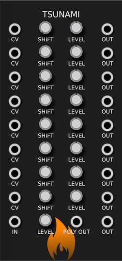

---
title: "Tsunami Manual"
author: [SV Modular]
date: "October, 2019"
subject: "Charred Desert"
keywords: [CharredDesert, VCVRack, Manual]
lang: "en"
titlepage: true
logo: "images/SVModular.png"
...

# Tsunami

**Tsunami** is a wave multiplier.  It takes an input via the `IN` jack and
multiplies eight times using an offset set via the *Shift* parameter and CV.

This offset wave is then added to the mix and the current value of the mix,
from top to bottom, is output in each *OUT* jack.

In addition, the *POLY OUT* output is a poly output with each channel set to the
unmixed, shifted output.
